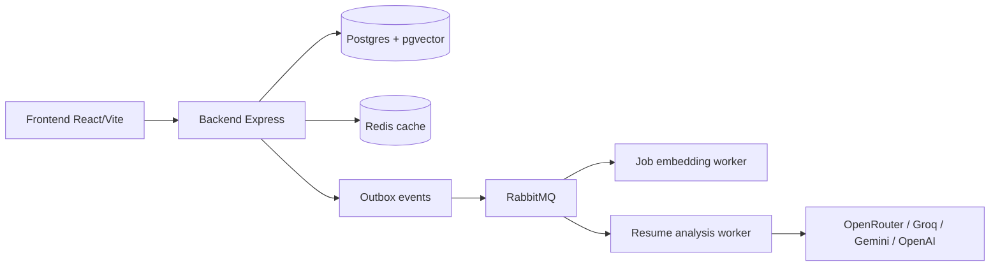

# CareerCopilot

AI-assisted career platform: upload a resume, analyze it against a job description, optimize for ATS, track applications, and discover matching jobs.

## Demo

| Environment         | URL                                                  |
| ------------------- | ---------------------------------------------------- |
| Local frontend      | http://localhost:3000                                |
| Local API           | http://localhost:5001/api/v1                         |
| API health          | http://localhost:5001/health                         |
| Staging / live demo | _Set `DEMO_URL` in your deploy env and link it here_ |

> Tip: with Docker Compose, open the frontend profile (`docker compose -f docker-compose.dev.yml --profile frontend up`) then visit http://localhost:3000.

## Screenshots

Place product screenshots in [`docs/screenshots/`](docs/screenshots/):

| File                                     | Description                          |
| ---------------------------------------- | ------------------------------------ |
| `docs/screenshots/01-job-feed.png`       | Job discovery / For You feed         |
| `docs/screenshots/02-resume-builder.png` | Resume upload & define-role flow     |
| `docs/screenshots/03-optimize.png`       | ATS score + suggestion optimize step |
| `docs/screenshots/04-export.png`         | Template preview & export            |

```text
docs/screenshots/
├── 01-job-feed.png
├── 02-resume-builder.png
├── 03-optimize.png
└── 04-export.png
```

## Architecture



## Features

- **Resume analysis** — ATS scoring, keyword gaps, AI suggestions (auth + ownership scoped)
- **Resume builder** — upload → analyze → apply improvements → export PDF/DOCX
- **Job discovery** — multi-provider ingestion + semantic recommendations
- **Applications** — track your pipeline
- **RBAC** — JWT auth with fine-grained permissions

## Quick start

### Prerequisites

- Node.js 22+
- Docker Desktop (Postgres, Redis, RabbitMQ)

### With Docker Compose (recommended)

```bash
cp backend/.env.example backend/.env   # if present; otherwise copy your secrets
docker compose -f docker-compose.dev.yml up -d
docker compose -f docker-compose.dev.yml --profile frontend up -d
```

Services:

| Service             | Port  |
| ------------------- | ----- |
| Backend API         | 5001  |
| Frontend            | 3000  |
| Postgres            | 5433  |
| Redis               | 6379  |
| RabbitMQ management | 15672 |

Resume analysis durability (outbox → RabbitMQ → worker) is enabled in compose via `RESUME_ANALYSIS_USE_OUTBOX=true` and the `resume-analysis-worker` service.

### Local (without full compose)

```bash
# Terminal 1 — infra
docker compose -f docker-compose.dev.yml up -d postgres redis rabbitmq

# Terminal 2 — API
cd backend
npm install
npx prisma migrate deploy
npm run prisma:seed
npm run dev

# Terminal 3 — optional durable analysis worker
cd backend
set RESUME_ANALYSIS_USE_OUTBOX=true   # Windows PowerShell: $env:RESUME_ANALYSIS_USE_OUTBOX='true'
npm run worker:outbox
npm run worker:resume-analysis

# Terminal 4 — frontend
cd frontend
npm install
npm run dev
```

Without `RESUME_ANALYSIS_USE_OUTBOX=true`, analysis runs inline in the API process (`setImmediate`) so local `npm run dev` still works.

### Background workers

The API offloads work to dedicated worker processes via RabbitMQ. Each worker runs independently with `npm run worker:<name>`:

| Worker                 | Command                                 | Purpose                                                                                     |
| ---------------------- | --------------------------------------- | ------------------------------------------------------------------------------------------- |
| Email                  | `npm run worker:email`                  | Sends transactional emails (OTP, welcome, security alerts) via SMTP                         |
| Resume analysis        | `npm run worker:resume-analysis`        | Runs AI resume analysis jobs (Gemini/Groq/OpenRouter) with retry fallbacks                  |
| Job embeddings         | `npm run worker:job-embeddings`         | Creates vector embeddings for jobs (pgvector + AI providers) for semantic recommendations   |
| Application submission | `npm run worker:application-submission` | Processes auto-apply submissions with reliability guarantees (locking, validation, retries) |
| Outbox relay           | `npm run worker:outbox`                 | Relays outbox events to RabbitMQ with configurable batch size and retry backoff             |

Without `RESUME_ANALYSIS_USE_OUTBOX=true`, analysis runs inline in the API process (`setImmediate`) so local `npm run dev` still works.

## Monorepo layout

```text
careercopilot/
├── backend/          Express API, Prisma, workers
├── frontend/         React + Vite + MUI
├── deploy/           Release / nginx / health scripts
├── docs/screenshots/ Product screenshots for README
└── .github/workflows CI quality gate, security, deploy
```

## Testing

```bash
# Backend unit tests
cd backend && npm test

# Frontend unit tests
cd frontend && npm test

# Playwright e2e (mocked APIs; starts Vite preview)
cd frontend && npm run test:e2e
```

CI runs frontend e2e smoke (job feed + resume-builder flow) in `.github/workflows/frontend-pr.yml`.

## Environment highlights

| Variable                                     | Purpose                                 |
| -------------------------------------------- | --------------------------------------- |
| `DATABASE_URL`                               | Postgres connection                     |
| `RABBITMQ_URL`                               | Message bus                             |
| `JWT_ACCESS_SECRET` / `JWT_REFRESH_SECRET`   | Auth                                    |
| `OPENROUTER_API_KEY` (or Groq/Gemini/OpenAI) | Resume analysis LLM                     |
| `RESUME_ANALYSIS_USE_OUTBOX`                 | `true` = durable queue; omit for inline |
| `CORS_ORIGIN`                                | Allowed frontend origins                |

## Security notes

- All `/resume-analysis/*` routes require auth + ownership (`resume.userId`)
- Helmet CSP is enabled (DOMPurify used on the frontend for untrusted HTML)
- Production nginx serves gzip + security headers
- Error responses never include stack traces in production

## License

Private / proprietary unless otherwise noted.
